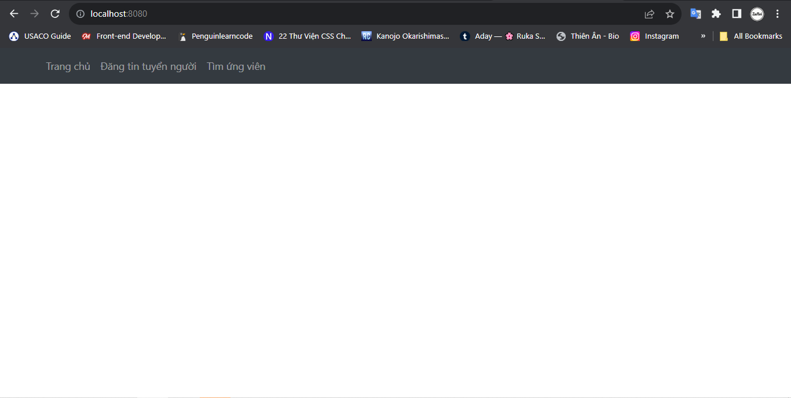
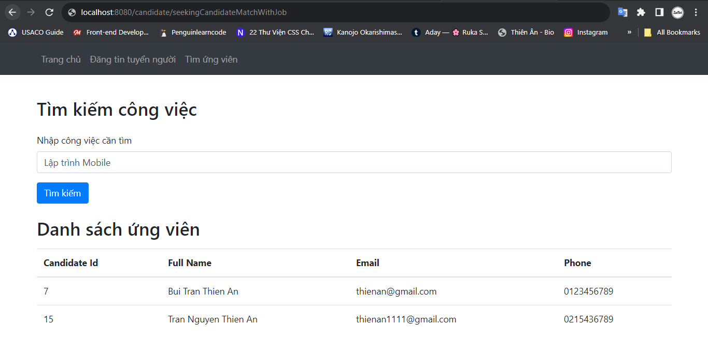
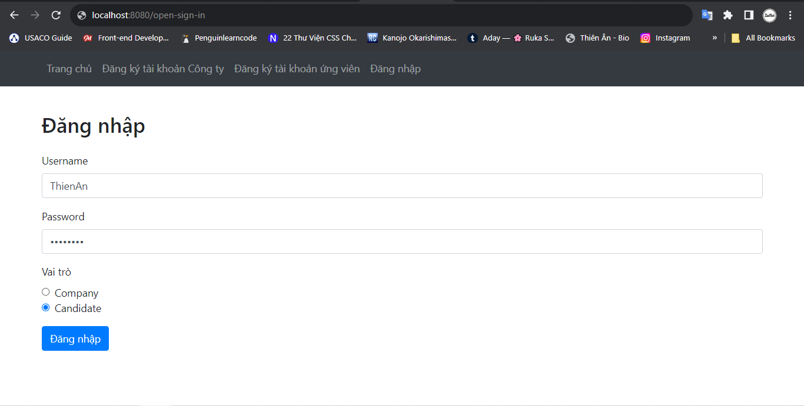
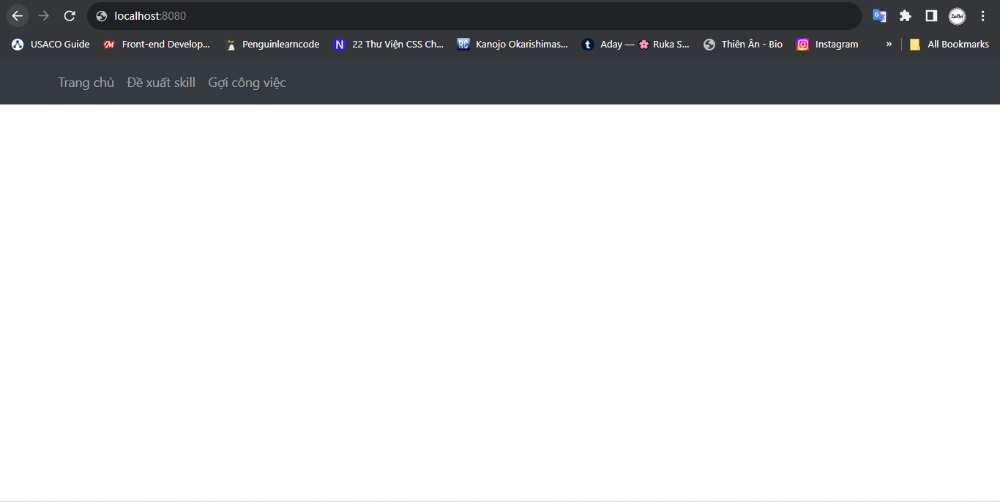
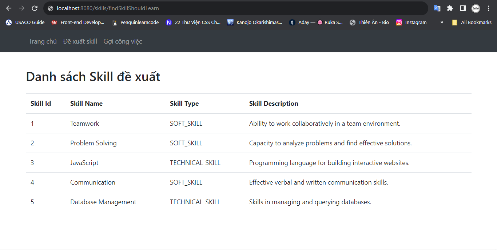

# 1. Trang chủ

# 2. Trang đăng ký tài khoản ứng viên

# 3. Trang đăng ký tài khoản công ty

# 4. Đăng nhập với tài khoản Company

# 5. Sau khi Đăng nhập với tài khoản Company, xuất hiện Menu gồm: Đăng tin tuyển người và Tìm ứng viên

# 6. Trang Đăng tin tuyển người

# 7. Trang Tìm ứng viên

# 8. Đăng nhập với tài khoản Candidate

# 9. Sau khi Đăng nhập với tài khoản Candidate, xuất hiện Menu gồm: Đề xuất skill và Gợi ý công việc

# 10. Trang đề xuất Skill
